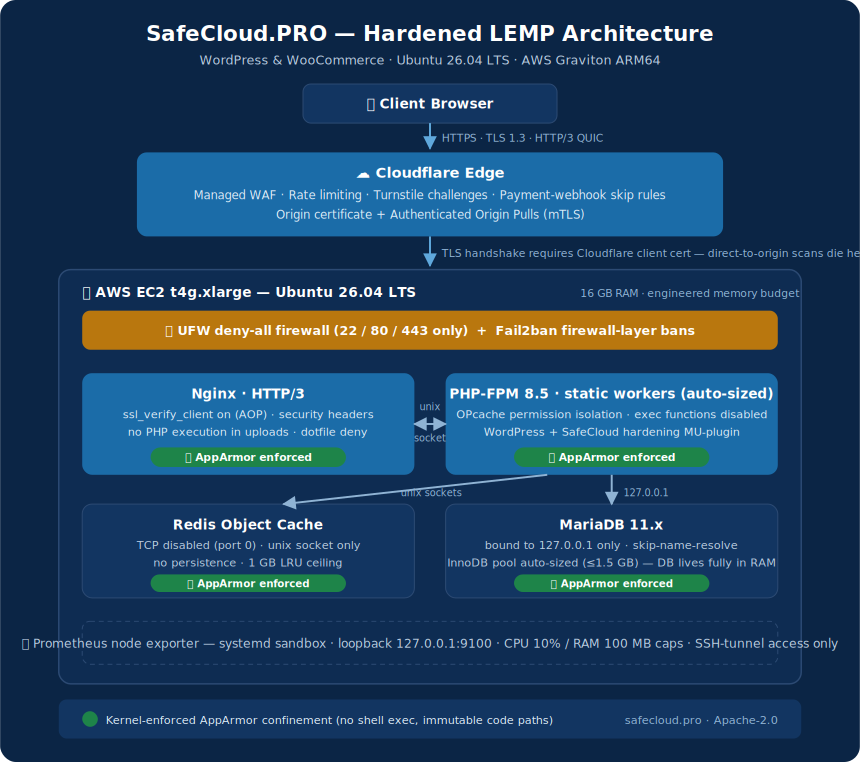
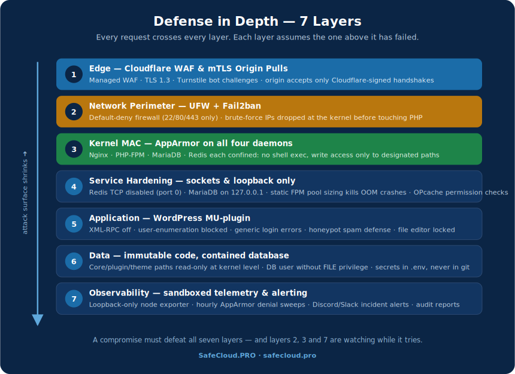

# Hardened Enterprise WordPress & WooCommerce Stack

**Production-grade security hardening, kernel confinement, and systems optimization for Ubuntu 26.04 LTS (Graviton/ARM64)**

[](LICENSE)


Welcome to the official open-source infrastructure repository of **[SafeCloud.PRO](https://safecloud.pro)**. It contains the automated provisioning script, AppArmor kernel-confinement profiles, Fail2ban perimeter configs, sandboxed monitoring units, and a WordPress Must-Use plugin that together deploy and audit a hardened, performance-tuned LEMP stack for mission-critical WordPress and WooCommerce storefronts.

The design premise: security is not a post-installation checklist but a **layered control plane**. Every daemon is confined at the kernel, every service speaks over local sockets, every ban happens at the firewall, and every denial gets reported — without compromising checkout performance or SEO.

---

## 🏗 Architecture



### The tiers at a glance

1. **Web tier — Nginx + cryptographic boundary.** Cloudflare **Authenticated Origin Pulls** (`ssl_verify_client on`) means any scanner that finds your Elastic IP is rejected during the TLS handshake — before a single byte of HTTP. HTTP/3 QUIC listeners keep mobile checkout fast; server blocks deny PHP execution in uploads and hide dotfiles/backups.
2. **Processing tier — static PHP-FPM pool.** A **static** worker pool replaces dynamic spawning: worst-case memory use becomes a design constant instead of a traffic-dependent surprise, so the OOM-killer never executes your database. The worker count is **auto-sized from the RAM the host actually has** (≈189 on a 16 GB box; pin it with `--php-workers`). OPcache runs with `validate_permission`/`validate_root` to block cross-pool bytecode leaks. On Ubuntu 26.04, OPcache is compiled into the PHP 8.5 binary (there is no `php8.5-opcache` package); `setup.sh` wires the hardened `opcache.ini` into the FPM and CLI SAPIs directly.
3. **Cache tier — socket-only Redis.** TCP listener disabled outright (`port 0`); the object cache exists purely as a Unix socket with an **auto-sized LRU ceiling** (~1 GB on a 16 GB box, ≤15 % of RAM) and persistence off. Port 6379 stops existing as an attack surface.
4. **Data tier — loopback MariaDB.** Bound strictly to `127.0.0.1` with `skip-name-resolve`, an **auto-sized InnoDB buffer pool** (25 % of RAM, capped at 1.5 GB in auto mode — a WordPress/WooCommerce working set is ~300 MB; pass `--db-pool` for more), and a documented path for revoking the `FILE` privilege from the WordPress user.
5. **Application tier — MU-plugin.** Loads before all standard plugins and can't be disabled from a compromised dashboard: XML-RPC off, user enumeration blocked, generic login errors, honeypot spam defense, SEO-safe author hiding.
6. **Telemetry tier — sandboxed exporter.** Prometheus node exporter under a strict systemd sandbox (read-only OS, no capabilities, syscall filter, 10% CPU / 100 MB caps), bound to `127.0.0.1:9100`, readable only through an SSH tunnel.

## 🛡 Defense in Depth



The kernel layer is the differentiator: **all four daemons ship with enforced AppArmor profiles.** Even a successful RCE in a vulnerable plugin cannot spawn a shell, write to core/plugin/theme code, read credentials outside its boundary, or open unexpected sockets — the kernel kills the attempt and the denial lands in your Discord/Slack channel within the hour.

---

## 📦 Repository Structure

```text
hardened-lemp-stack/
├── setup.sh                     # Master provisioner (interactive & headless CI/CD modes)
├── manage.sh                    # One dispatcher for every tool (setup, tune, backup, audit, lint, test…)
├── tune-stack.sh                # Re-tune an installed stack to the host's RAM/CPU (detect → confirm → propose → apply)
├── configure-security-group.sh  # Generate AWS CLI commands to restrict EC2 ingress to Cloudflare (via prefix lists)
├── configure-cloudflare-realip.sh # nginx real-IP restoration behind Cloudflare (so Fail2ban bans the real client)
├── install-cloudflare-cert.sh   # Install a Cloudflare Origin cert + key, wire Nginx, reload (rollback-safe)
├── wordpress-provision.sh       # Create WP database + user, secure MariaDB, install WordPress + wp-config
├── harden-wordpress.sh          # App-layer WP hardening: wp-config constants, perms, MU-plugin (idempotent)
├── enable-redis-cache.sh        # Install + wire the Redis object-cache drop-in over the hardened socket
├── backup.sh / restore.sh       # DB + wp-content + wp-config backup/restore (gpg + retention + optional S3)
├── lib/sizing.sh                # Shared RAM→budget math used by setup.sh and tune-stack.sh
├── tests/sizing.bats            # Unit tests for the sizing math (run by CI)
├── DEPLOY.md                    # Post-setup runbook: certificate → connectivity → WordPress, in order
├── HARDEN-WORDPRESS.md          # What harden-wordpress.sh changes, and the updates trade-off
├── CHANGELOG.md                 # Notable changes
├── apparmor/                    # Kernel MAC profiles, named after their deploy targets
│   ├── usr.sbin.nginx           #   Nginx web tier
│   ├── usr.sbin.php-fpm         #   PHP-FPM pool (named profile "php-fpm")
│   ├── usr.sbin.mariadbd        #   MariaDB 11.x
│   ├── usr.sbin.redis-server    #   Redis cache
│   ├── redis-server-apparmor.conf #  systemd drop-in that attaches the Redis profile under NoNewPrivileges
│   └── README.md
├── fail2ban/                    # Firewall-layer brute-force defense
│   ├── jail.local               #   Jail policy (UFW ban action)
│   ├── filter.d/                #   nginx-wp-login + nginx-apparmor filters
│   └── README.md
├── scripts/                     # Day-2 operations tooling
│   ├── status-report.sh         #   Full stack security audit (text / JSON / CI exit codes)
│   ├── verify-apparmor.sh       #   Confinement verification + compliance report
│   ├── alert-apparmor-status.sh #   AVC denial sweeper → Discord/Slack alerts
│   ├── fail2ban-report.sh       #   Ban statistics digest
│   ├── performance-benchmark.sh #   Redis socket vs TCP, HTTP load, sizing audit
│   └── README.md
├── monitoring/                  # Sandboxed telemetry & scheduling
│   ├── prometheus-node-exporter.service
│   ├── safecloud-sentinel.cron
│   ├── prometheus-alerts.yml    #   Alerting rules for the node exporter
│   ├── grafana-dashboard.json   #   Importable host dashboard
│   ├── logrotate-safecloud      #   Rotation for the stack's own logs
│   └── README.md
├── wordpress/
│   ├── mu-plugins/safecloud-hardening.php
│   └── README.md
├── docs/                        # Per-tool manuals, cheat sheets, test plan, brand assets
├── .env.example                 # Secrets template (never commit a real .env)
├── CONTRIBUTING.md              # Workflow, validation gates, vulnerability disclosure
└── LICENSE                      # Apache-2.0
```

> The validation gates below (ShellCheck, `apparmor_parser`, `php -l`) are the
> checks contributors run locally before a PR; run them yourself after any edit.

---

## 🚀 Deployment Playbook

### Step 1 — Provision the AWS host

1. Launch a **t4g.xlarge** (ARM64) instance with the official **Ubuntu 26.04 LTS** image.
2. Security Group inbound rules: **TCP 22** from your admin CIDRs only; **TCP 80/443 + UDP 443** from [Cloudflare edge IP ranges](https://www.cloudflare.com/ips/) (or public, if you rely on AOP alone).
3. Enable **EBS volume encryption** for the root and data volumes.

### Step 2 — Run the provisioner

```bash
git clone https://github.com/safecloudpro/hardened-lemp-stack.git
cd hardened-lemp-stack
chmod +x setup.sh tune-stack.sh configure-security-group.sh scripts/*.sh

sudo ./setup.sh              # interactive: explains each component, asks approval
```

After the components install, `setup.sh` **offers two optional post-install steps**
(interactive mode asks; headless auto-applies the tuning, and runs the Security
Group step in plan-only mode when `--configure-sg` is passed):

* **Fine-tuning** — [`tune-stack.sh`](tune-stack.sh) re-checks every service against the
  detected RAM/CPU and scales secondary knobs (nginx `worker_connections`, OPcache
  memory) that don't come out of the install defaults. Skip with `--no-tune`.
* **Cloudflare Security Group** — [`configure-security-group.sh`](configure-security-group.sh)
  can lock inbound 80/443 to Cloudflare's ranges (see Step 3).

Headless mode for automation (every memory setting auto-sizes to detected RAM):

```bash
sudo ./setup.sh --yes                       # fully auto-sized; PHP version auto-detected from APT
sudo ./setup.sh --yes --db-pool 2G          # pin the DB pool, auto-size the rest
```

Preview the memory budget without touching the system (safe to run unprivileged):

```bash
./setup.sh --dry-run
```

> Verified on a fresh **Ubuntu 26.04 LTS / ARM64** host (15.4 GB RAM): auto-sizing
> chose PHP 8.5, a 1.5 GB InnoDB pool, a 1 GB Redis cap, and 189 static PHP-FPM
> workers; all seven components reported `SUCCESS`. `setup.sh` is idempotent — a
> second run reconfigures cleanly.

### Step 3 — Configure Cloudflare

1. Enable **Authenticated Origin Pulls** (SSL/TLS → Origin Server) — the origin already enforces it, so do this **before** cutting DNS over.
2. Generate an **Origin Certificate** and install it in the Nginx server block (replace the placeholder snakeoil paths).
3. Add **WAF skip rules** scoped to your payment webhook paths only (e.g. `/wc-api/v3/stripe/`, `/wc-api/paypal/`).
4. Create a **Turnstile** widget and keep the keys in `.env` (see `.env.example`).
5. **Lock the origin's inbound firewall to Cloudflare.** So a scanner that finds
   your Elastic IP can't reach the origin at all, restrict the EC2 Security Group
   to Cloudflare's ranges:

   ```bash
   ./configure-security-group.sh              # writes ./cloudflare-sg-commands.sh (does NOT call AWS)
   # then, where AWS credentials with EC2 permissions are active:
   aws sts get-caller-identity                # confirm the right account/role
   bash ./cloudflare-sg-commands.sh           # create prefix lists + SG, attach to this instance
   ```

   The generator pulls Cloudflare's **current** IP ranges, self-identifies the
   instance via IMDSv2, and writes a reviewable, idempotent script of `aws ec2 …`
   commands with this instance's real IDs baked in — it never calls AWS itself, so
   you run it under your own credentials (IAM role / `aws configure` profile /
   CloudShell). Because Cloudflare publishes 22 ranges, the commands reference two
   managed **prefix lists** to stay under the per-SG rule limit, and **add** the SG
   alongside your existing ones (never replacing them, so an active SSH session
   can't be cut). Modes: `--mode cloudflare` (default), `--mode public`,
   `--mode custom`. See the script's `--help` for the least-privilege IAM actions.

### Step 4 — Deploy the kernel and application layers

```bash
# AppArmor profiles (complain-mode rollout guide: apparmor/README.md)
sudo cp apparmor/usr.sbin.* /etc/apparmor.d/

# MariaDB ships its OWN profile at /etc/apparmor.d/mariadbd with the same
# attachment path — two profiles for one binary leave mariadbd UNCONFINED.
# Disable the distro profile before loading this repo's:
sudo mkdir -p /etc/apparmor.d/disable
sudo ln -sf /etc/apparmor.d/mariadbd /etc/apparmor.d/disable/mariadbd
sudo apparmor_parser -R /etc/apparmor.d/mariadbd 2>/dev/null || true

for p in usr.sbin.nginx usr.sbin.php-fpm usr.sbin.mariadbd usr.sbin.redis-server; do
  sudo apparmor_parser -r -W "/etc/apparmor.d/$p"
done

# Redis's unit sets NoNewPrivileges=true, which blocks the kernel's implicit
# path-based attachment — the profile must be attached explicitly by systemd:
sudo mkdir -p /etc/systemd/system/redis-server.service.d
sudo cp apparmor/redis-server-apparmor.conf /etc/systemd/system/redis-server.service.d/apparmor.conf
sudo systemctl daemon-reload

sudo systemctl restart nginx php8.5-fpm mariadb redis-server   # match your PHP version

# Fail2ban perimeter (whitelist your admin IPs first — fail2ban/README.md)
sudo cp fail2ban/jail.local /etc/fail2ban/jail.local
sudo cp fail2ban/filter.d/*.conf /etc/fail2ban/filter.d/
sudo systemctl restart fail2ban

# WordPress MU-plugin
sudo mkdir -p /var/www/html/wp-content/mu-plugins
sudo cp wordpress/mu-plugins/safecloud-hardening.php /var/www/html/wp-content/mu-plugins/

# Redis object cache: install the "Redis Object Cache" plugin and point it at
# unix:///var/run/redis/redis-server.sock (constants in .env.example)
```

### Step 5 — Verify posture and benchmark

```bash
sudo ./scripts/status-report.sh -o ./system_status_report.txt   # full audit → file
sudo ./scripts/verify-apparmor.sh                               # confinement compliance
./scripts/performance-benchmark.sh -c 50 -n 5000                # load + sizing audit
sudo ./tune-stack.sh --dry-run                                  # re-check sizing vs this host (propose only)
```

Whenever the instance is resized (more/less RAM), re-run **`sudo ./tune-stack.sh`**:
it detects the running services, recomputes the budget for the new RAM, shows a
current-vs-proposed diff, and applies on approval — backing up each config and
rolling back any service whose restart fails.

Optional continuous monitoring (hourly denial sweeps + webhook alerts): see [monitoring/README.md](monitoring/README.md).

### Step 6 — Bring up the WordPress site

Once the stack is provisioned and hardened, follow the **[DEPLOY.md](DEPLOY.md)** runbook to
go live behind Cloudflare in the order that avoids this stack's common errors:

1. **Install the origin certificate** — `install-cloudflare-cert.sh` validates and installs a Cloudflare Origin cert + key and wires Nginx to it (rollback-safe).
2. **Set Cloudflare to Full (strict)**, then open the **AWS Security Group** (443/80) and confirm DNS points at the origin's Elastic IP.
3. **Handle Authenticated Origin Pulls** — keep `ssl_verify_client` off until AOP is enabled in Cloudflare (prevents the `400` / `525`).
4. **Install WordPress** — `wordpress-provision.sh` creates the database + user, secures MariaDB (local-only), installs the latest WordPress into `/var/www/html` (matches the nginx root + AppArmor profile), and writes `wp-config.php`.
5. **Harden WordPress** — `harden-wordpress.sh` applies `wp-config.php` security constants, locks file permissions, removes disclosure files, and deploys the MU-plugin (see [HARDEN-WORDPRESS.md](HARDEN-WORDPRESS.md)).
6. **Finish the install in the browser** — with the default webroot no nginx change is needed.

See [DEPLOY.md](DEPLOY.md) for the full commands, prompts, and a Cloudflare error-code reference (522/525/526/400).

---

## 🔍 Honest Scope & Shared Responsibility

* This stack hardens a **single-box LEMP origin behind Cloudflare**. Multi-host topologies (separate DB instance) are supported conceptually — enable MariaDB TLS as noted in `setup.sh` — but the shipped defaults assume localhost.
* The `nginx-apparmor` Fail2ban jail is **experimental and disabled by default**: stock kernel AVC records don't include client IPs (details in [fail2ban/README.md](fail2ban/README.md)). AppArmor violations are alerted, not auto-banned.
* Kernel-immutable plugin/theme paths mean dashboard auto-updates are blocked by design — update via WP-CLI/deploy pipelines, or temporarily set the profile to complain mode.
* SafeCloud.PRO provides the hardened substrate; application audits, plugin vetting, and merchant compliance (PCI DSS SAQ scope) remain the store operator's responsibility.

## 🤝 Contributing & Security Disclosures

Contributions are welcome — read [CONTRIBUTING.md](CONTRIBUTING.md) for the validation gates (ShellCheck, `apparmor_parser`, PHPCS) that CI enforces. **Security vulnerabilities:** never open a public issue; email **dev@safecloud.pro**.

## ⚖ License

Distributed under the **[Apache License 2.0](LICENSE)** — free commercial and private use, explicit patent grant, no warranty. The WordPress MU-plugin is licensed **GPLv2 or later** per WordPress plugin convention.

---

*Maintained and audited by the [SafeCloud.PRO](https://safecloud.pro) security engineering practice.*
